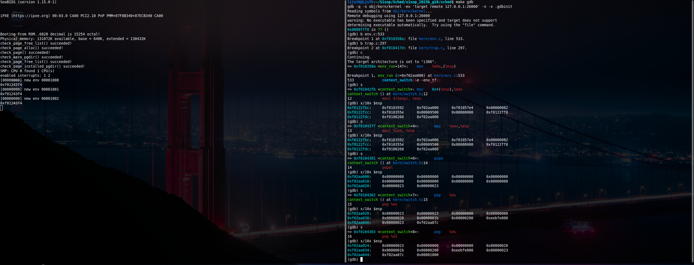
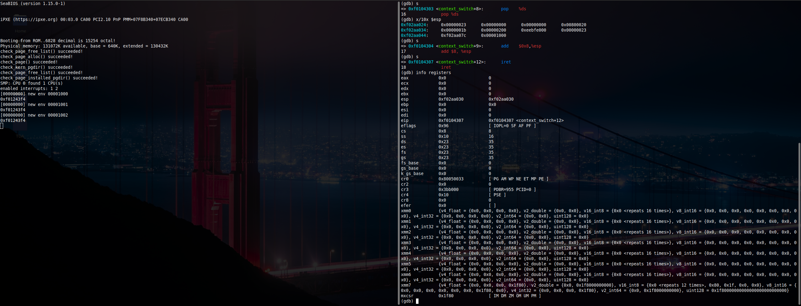
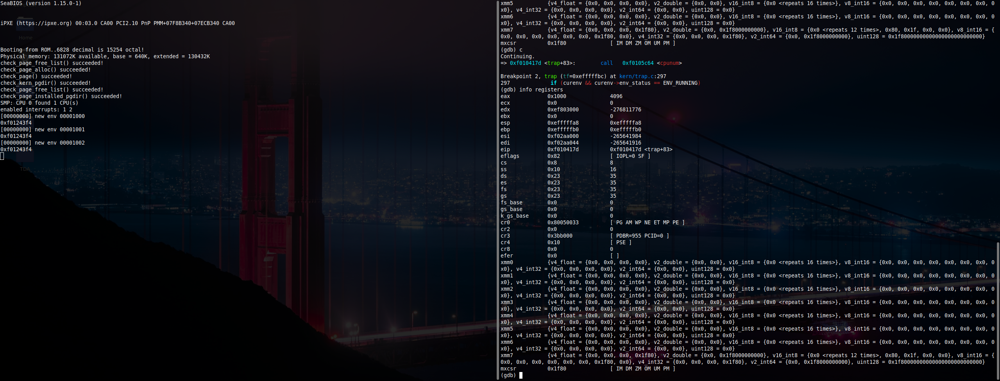

# sched

## Seguimiento con GDB
Primer foto donde se ve que se llama a context switch y muestra el estado del stack durante las instrucciones iniciales

Segunda imagen en la que se ve el estado de los registros antes de ejecutar iret.

Tercera imagen en la que se muestra el estado de los registros luego de iret y que se llega a _alltraps para luego caer en trap.c

## Documentacion PRIORIDADES
El sistema de prioridades que se eligio fue un **Proportional Share** o tambien conocido como **Planificacion por Loteria**. Este se basa en que cada vez que se llama al scheduler se realiza un sorteo para determinar que proceso tiene que ejecutarse a continuación, por ende los procesos que deban ejecutarse con mas frecuencia tiene que tener mas posibilidades de ganar la lotería.

Para esto entonces cada proceso (env) va a tener una cantidad de **tickets** (Definido env_tickets en el struct Env). 
Esta cantidad de tickets se le asigna al env en la funcion env_alloc cuando se inicializa con una constante TICKET_STEP. 

Para el manejo luego de los tickets del env se definieron dos syscalls: **sys_env_set_priority** y **sys_env_get_priority**
- __sys_env_set_priority__: le resta tickets al env actual
- __sys_env_get_priority__: devuelve los tickets del env

Cabe aclarar que esta implementacion tambien modifico la syscall fork, para que el hijo herede los tickets del padre. 

Por ultimo entonces y uno de los detalles mas importantes es la modificacion de la funcion yield en sched.c , enves de realizar round-robin se llama a la funcion lottery. 

En la funcion lottery se busca la cantidad de tickets totales para luego calcular el ganador mediante una funcion auxiliar next_random(), para luego correr solamente el proceso que gana la loteria. Este seria el sistema de eleccion de que env correr.

Nota: para conseguir un numero al azar se utilizo la funcion lcg_parkmiller obtenida de: https://www.cs.virginia.edu/~cr4bd/4414/S2019/lottery.html#hints

